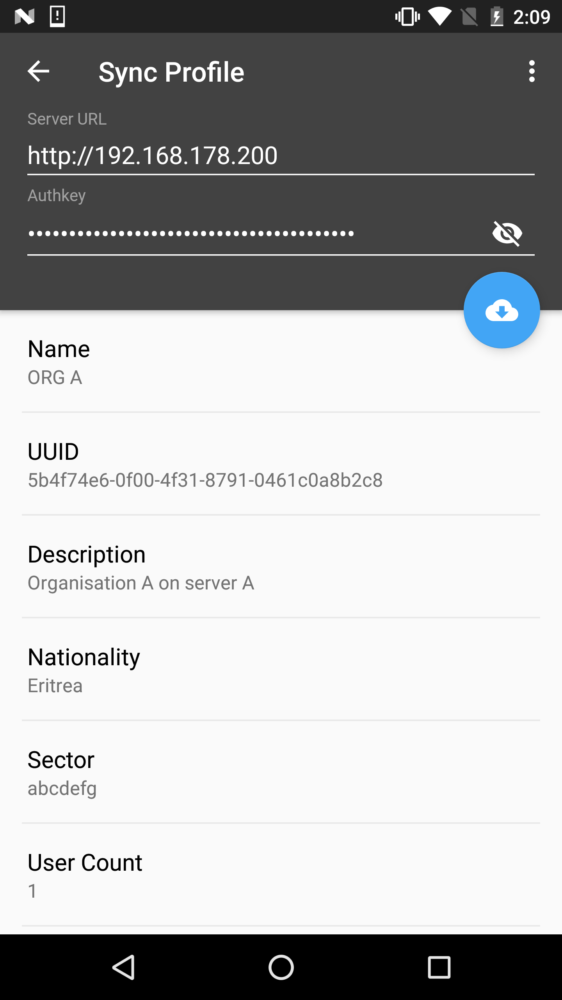
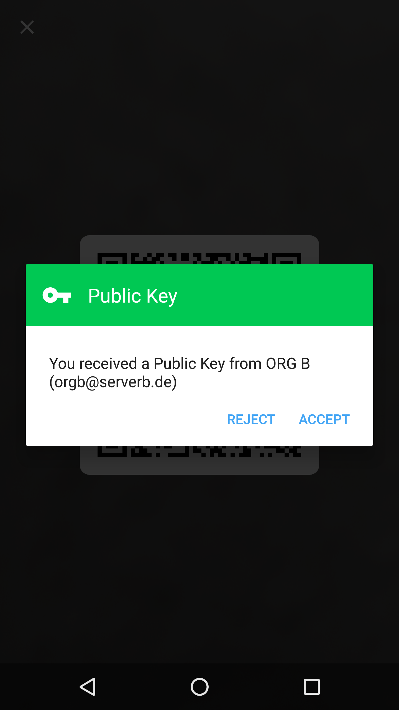
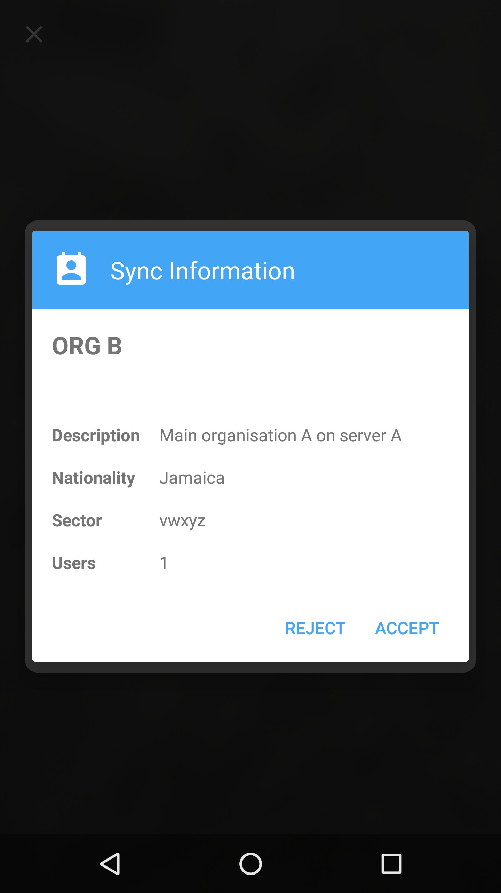
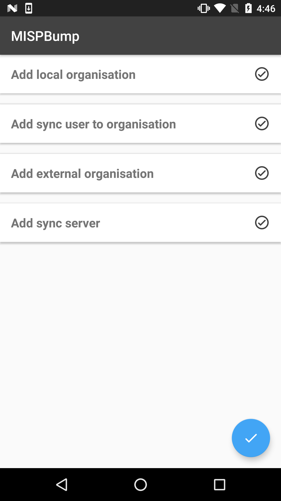
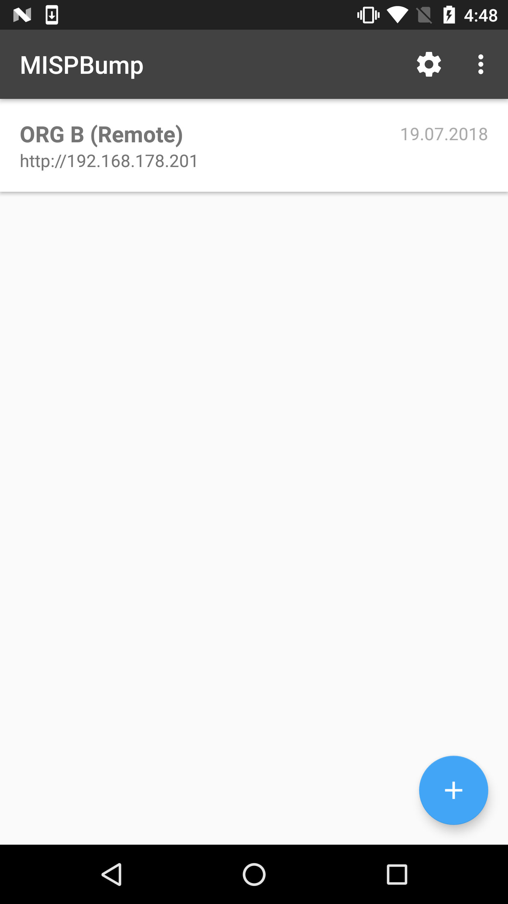

# MISPBump

With MISPBump it is easy to synchronise events on different MISP instances. Instead of generating organisations, sync-users and sync-servers you only have to scan two QR-Codes and you are ready for syncing.

# Security

A key agreement is realized with Diffie Hellman (Elliptic Curve 256 Bit), sensible data is encrypted with AES.  

TODO: how are credentials stored in app, keystore?

# How does it work?

1. Gather your organisation information from your MISP instance

1. Scan your partners generated public key and at the same time share yours

2. Validate the public key you scanned

3. After another scan the information you need to synchronise is securely transmitted to your phone

4. Upload the information to your own MISP instance

5. That's it! You are ready to share events across your instances

