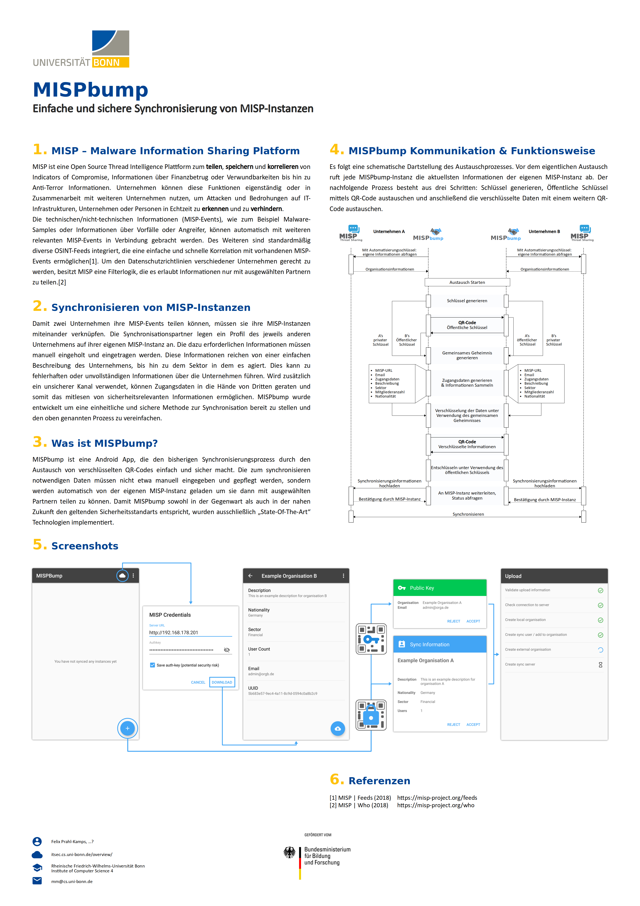

# What does this app?
1. Exchange public keys to make following communication private (via QR code)
    + Diffie Hellman key exchange
2. Exchange encrypted information needed to sync two MISP instances
3. Upload information to MISP instance.

# MISPBump

