# Screenshots

## Home
Entrypoint of the app.

Actions: **Profile View** (Menubar) and **New Sync** (Floating Action Button)

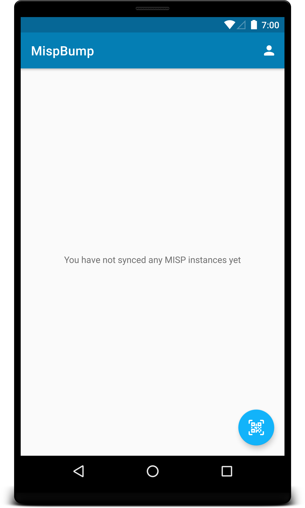

## Profile
Basic information about the organisation that is currently logged in.

Actions: **Delete and logout** (Menubar) and **Update Info** (Floating Action Button)

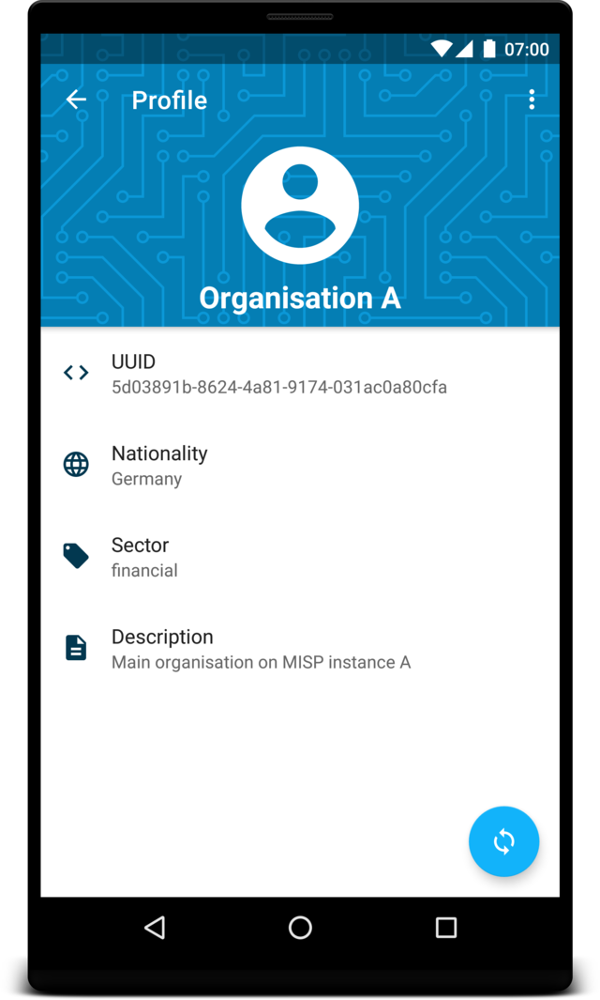

## Sync

Core functionality of MISPbump.

**First Step:** Exchange keys to derive a shared secret

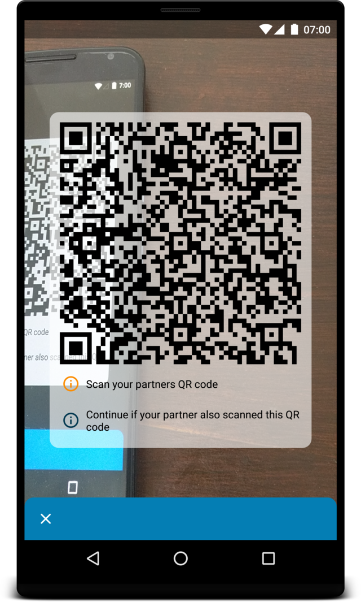
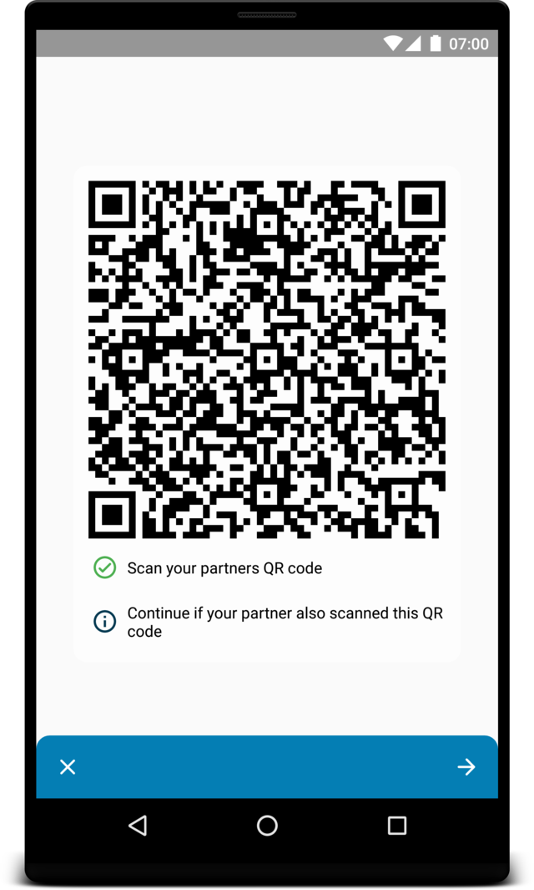

**Second Step:** Exchange encrypted sync information

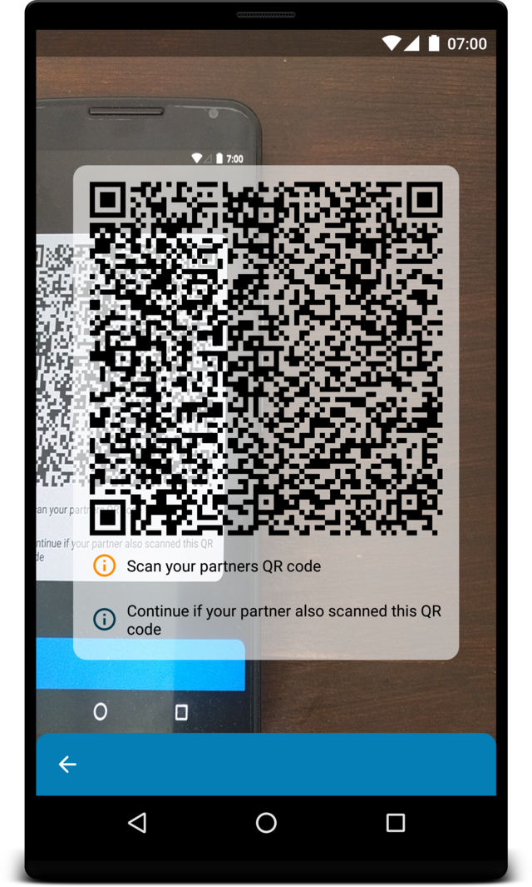
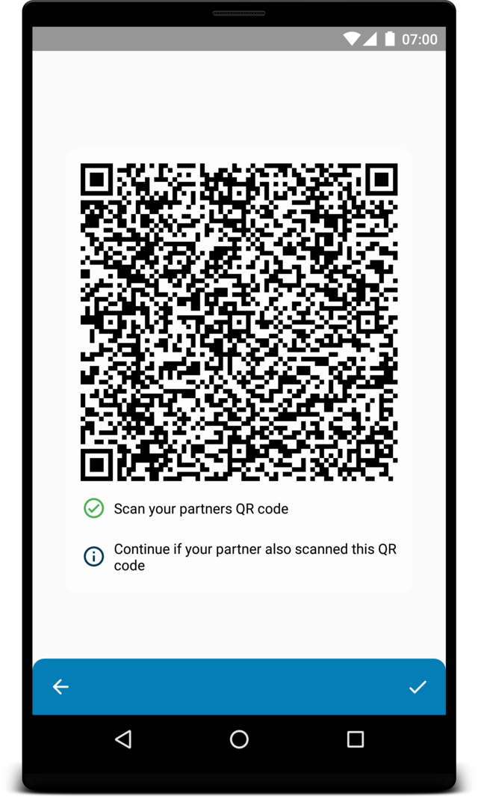

## Sync information

After a successfull exchange an entry for this organisation will appear.

Actions: **Delete Sync information** (Menubar) and **Upload** (Floating Action Button in settings tab)

**Credentials:** With this credentials you will be able to log in on the other MISP instance (SyncUser)

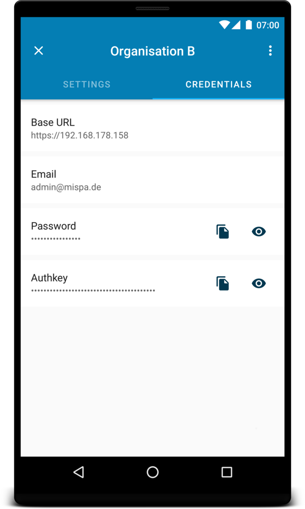

**Settings:** These are typical settings which are also available from the MISP web interface.

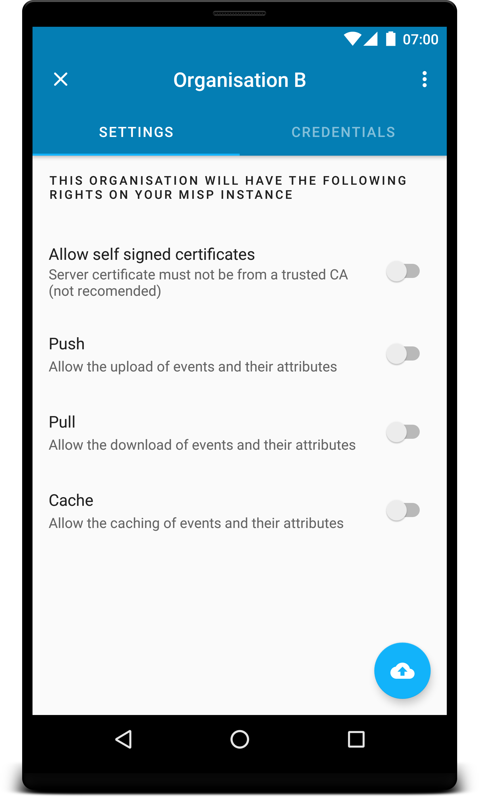

## Upload

Shows the status of the upload to your MISP instance.
If errors occure they will be displayed and the user can restart the process.

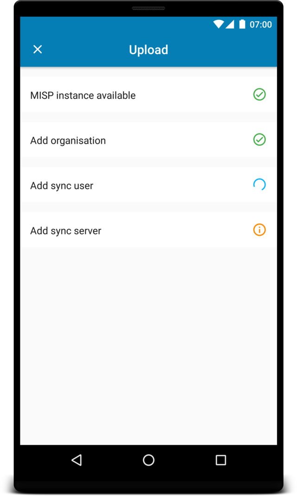
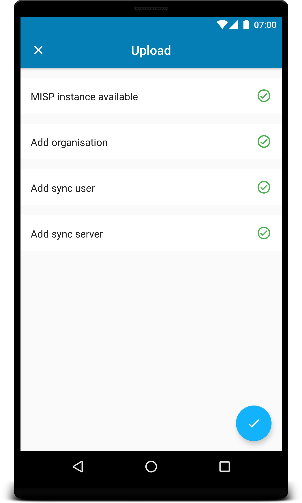

## Home with successfull sync

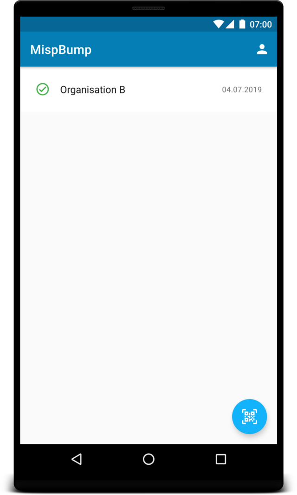

# What does this app?
1. Exchange public keys to make following communication private (via QR code)
    + Diffie Hellman key exchange
2. Exchange encrypted information needed to sync two MISP instances
3. Upload information to MISP instance.

# MISPBump

