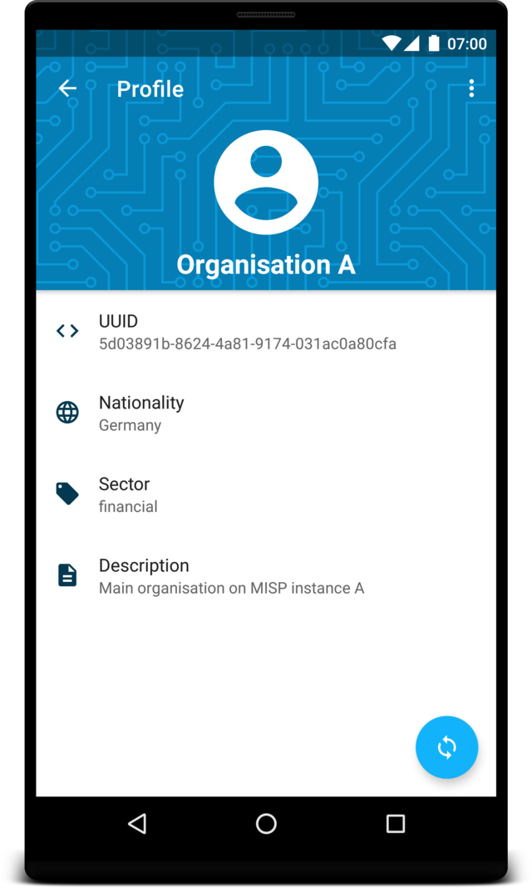
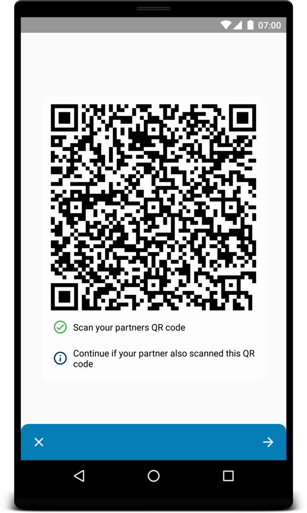
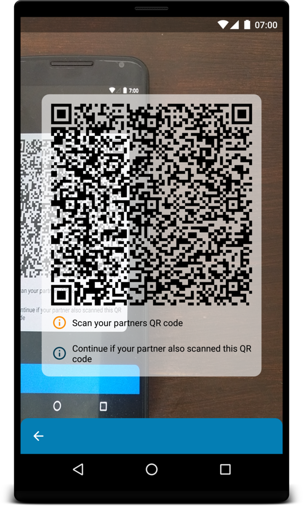
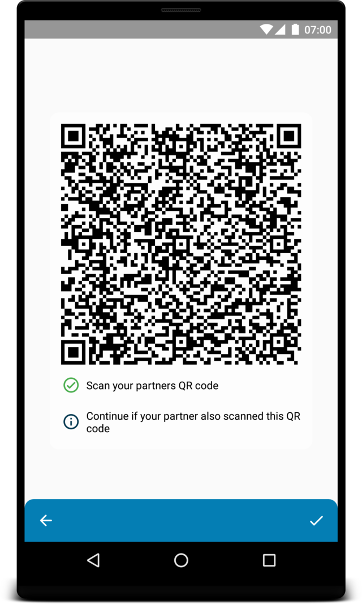
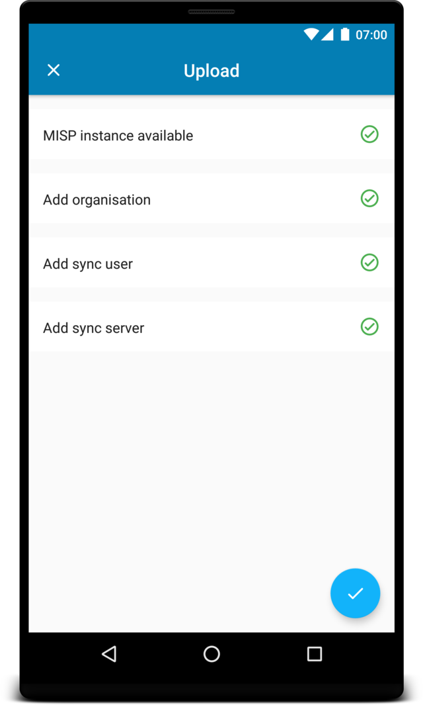
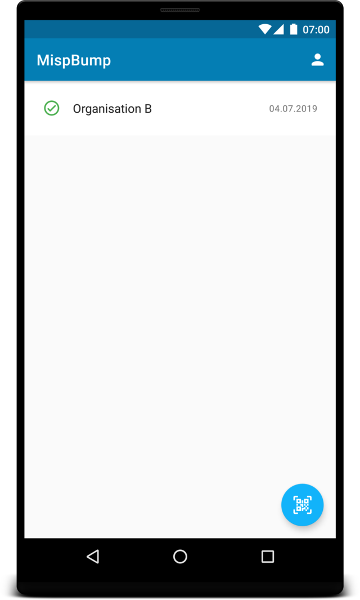

# Screenshots

## Login

## Home

Actions: **Profile View** (Menubar) and **New Sync** (Floating Action Button)

## Profile
Organisation information loaded automatically from your MISP instance

Actions: **Delete and logout** (Menubar) and **Update Info** (Floating Action Button)

## Sync

Core functionality of MISPbump.

**First Step:** Exchange keys to derive a shared secret

**Second Step:** Exchange encrypted sync information

## Sync information

After a successfull exchange an entry for this organisation will appear.

Actions: **Delete Sync information** (Menubar) and **Upload** (Floating Action Button in settings tab)

**Credentials:** With these credentials you will be able to log in on the other MISP instance (SyncUser)

**Settings:** These are typical settings which are also available from the MISP web interface.

## Upload

Shows the status of the upload to your MISP instance.
If errors occure they will be displayed and the user can restart the process.

## Home with successfull sync

